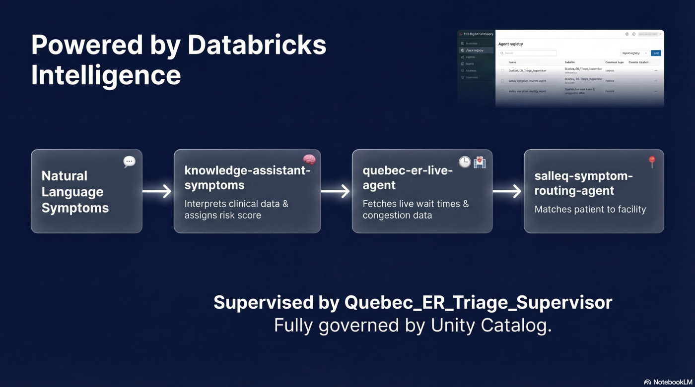
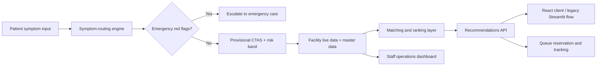

# SalleQ

SalleQ is an AI-assisted virtual waiting room for non-emergency care in Quebec. It was built during the EY x Databricks AI Agent Hackathon in Montreal, where it placed **2nd overall**.

The product accepts natural-language symptom input, estimates a conservative provisional CTAS level, calculates a risk score, detects emergency red flags, and recommends the best care site based on acuity, live wait conditions, facility type, and distance.


## Why It Matters

Emergency departments are crowded, but many patients still need help deciding where to go. SalleQ was built to reduce that uncertainty. It combines symptom intake, triage-style routing, live Quebec emergency room data, and queue-aware recommendations in one flow.

## Highlights From The Pitch Deck

- **The problem is large and immediate.** The deck frames Quebec emergency care as a capacity problem: roughly 2 million patients without a primary care provider, non-critical waits reaching 18 hours, and an estimated 30 to 50 percent of ER visits being non-urgent.
- **There is precedent for the model.** The team benchmarked virtual queue programs such as Sault Area Hospital's virtual home waiting room, which reported a 25 percent drop in ER wait times, shorter length of stay, and fewer patients leaving without being seen.
- **SalleQ was pitched as a Quebec-specific redesign of the intake journey.** The current state is blind arrival, manual physical triage, and crowded waiting rooms. The SalleQ state is predictive load balancing, AI-assisted remote symptom intake, and safe at-home waiting until the patient should leave.
- **The user flow was presented as a four-step product.** Context and identity capture, AI triage with hard-stop safety checks, precision routing to the most appropriate facility, and a virtual waiting room with dynamic notifications and timed arrival.
- **The routing logic was intentionally practical.** The pitch emphasized distance, live availability, wait time, and acuity match as the main ranking signals rather than generic recommendation logic.
- **The Databricks story was part of the product story.** The deck showed a governed multi-agent pipeline: natural-language symptoms feeding a knowledge assistant, a Quebec ER live-data agent, and a symptom-routing agent supervised through Databricks and Unity Catalog.
- **The roadmap stayed grounded.** The deck explicitly called out current limits around hospital integration, privacy, and private-clinic coverage, then pointed to bi-directional hospital integration and a stronger staff dashboard as the next steps.



## What SalleQ Does

- Accepts patient symptoms in plain language
- Flags emergency red-alert patterns and stops unsafe routing flows
- Assigns a provisional CTAS level for routing support
- Scores risk using deterministic clinical-style rules
- Recommends hospitals or ambulatory sites based on urgency and live conditions
- Supports queue reservation and queue tracking flows
- Provides a staff view for operational load and facility-level visibility

## How It Works

1. A patient enters symptoms, age group, and optional location.
2. The routing engine extracts the primary symptom, detects emergency signals, and estimates a provisional CTAS band.
3. Quebec emergency room live status data is ingested and joined with facility master data.
4. Facilities are filtered and ranked using acuity fit, wait conditions, queue depth, and travel distance.
5. The API returns recommendations and supports reservation and tracking workflows.

## System Overview



## Architecture

- `src/app/server`: FastAPI app, routers, Databricks SQL access, patient-flow orchestration, and staff endpoints
- `src/agents`: main patient and staff routing logic recovered from the Databricks app
- `src/symptom_routing`: deterministic symptom-routing sidecar recovered from the separate agent project
- `src/ingestion`: Quebec ER live scraping, facility ingestion, bootstrap jobs, and refresh jobs
- `src/matching` and `src/ranking`: facility matching and recommendation ranking
- `app/client`: recovered React + TypeScript + Vite client
- `app/legacy_streamlit`: earlier Streamlit implementation preserved for reference
- `sql`: schemas, views, grants, and simulated-case seed scripts
- `notebooks`: exported Databricks setup, demo, and validation notebooks
- `configs/databricks`: recovered Databricks app and bundle configuration, sanitized for public sharing
- `docs`: demo notes, dashboard export, prototype assets, and AI dev kit notes

## Repository Layout

```text
salleq/
  README.md
  .gitignore
  requirements.txt
  src/
  app/
  notebooks/
  data/
  configs/
  docs/
```

## Tech Stack

- Python
- FastAPI
- React
- TypeScript
- Vite
- Databricks Apps
- Databricks SQL
- Databricks Jobs
- MLflow / Databricks Agents
- PySpark
- BeautifulSoup, Requests, HTTPX

## Hackathon Assets

- [`SalleQ hackathon deck`](docs/hackathon/SalleQ_Hackathon_Deck.pptx)
- [`Second-place award photo`](docs/hackathon/salleq-second-place-award-photo.jpg)
- [`Second-place certificate photo`](docs/hackathon/salleq-second-place-certificate.jpg)
- [`Team photo from the event`](docs/hackathon/salleq-hackathon-team-photo.jpg)
- [`Powered by Databricks Intelligence slide`](docs/hackathon/powered-by-databricks-intelligence-slide.png)

## Running Locally

This repo is reviewable without access to the original Databricks workspace, but end-to-end execution still requires Databricks resources.

1. Use Python 3.11+ and create a virtual environment.
2. Install Python dependencies:

```bash
python -m venv .venv
source .venv/bin/activate
pip install -r requirements.txt
```

3. Build the front end:

```bash
cd app/client
npm install
npm run build
```

4. Configure the Databricks environment variables you need, including:
   `DATABRICKS_HOST`, `DATABRICKS_TOKEN`, `DATABRICKS_WAREHOUSE_ID`, `DATABRICKS_CATALOG`, `DATABRICKS_SCHEMA`, and `APP_ENCRYPTION_KEY`

5. Start the API:

```bash
uvicorn src.app.server.app:app --reload
```

Without Databricks credentials and a live warehouse, the ranking and queue flows cannot run fully against live data. The recovered code, tests, SQL, notebooks, and UI are still reviewable locally.

## What To Review First

- [`src/app/server/app.py`](src/app/server/app.py)
- [`src/symptom_routing/assistant/agent.py`](src/symptom_routing/assistant/agent.py)
- [`src/ingestion/qc_er_scraper.py`](src/ingestion/qc_er_scraper.py)
- [`src/ranking/facility_ranker.py`](src/ranking/facility_ranker.py)
- [`app/client/src/App.tsx`](app/client/src/App.tsx)
- [`docs/analytics/healthcare_facilities.lvdash.json`](docs/analytics/healthcare_facilities.lvdash.json)

## Recovery Note

This repository was reconstructed from Databricks workspace assets after the hackathon. The goal was to preserve the original implementation, recover the real project structure, and make the code reviewable outside the workspace.

The migration record, recovered source map, inferred pieces, and remaining cleanup items are documented in [`MIGRATION_NOTES.md`](MIGRATION_NOTES.md).
